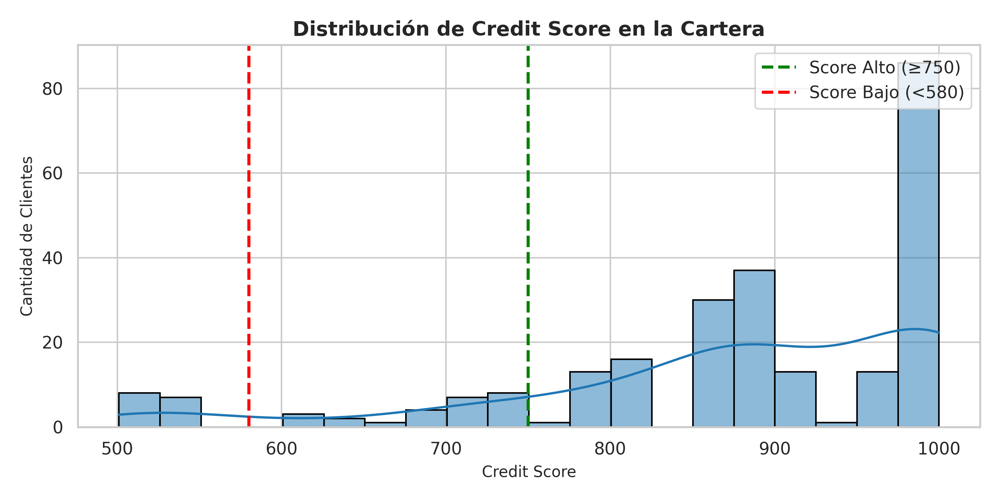
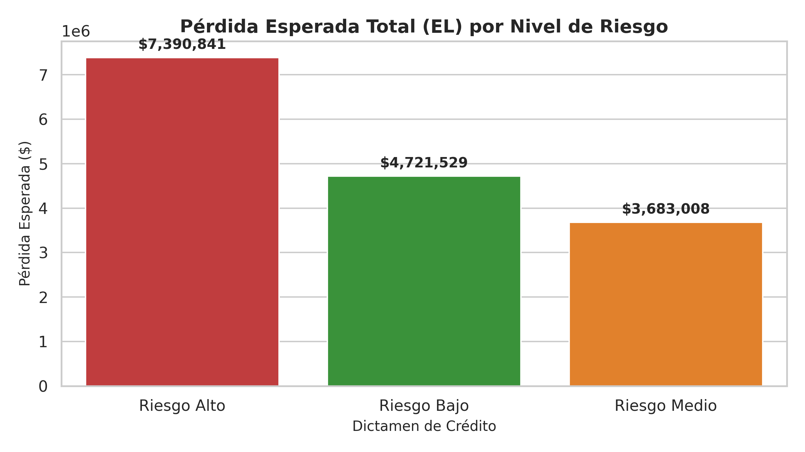

# Análisis de Riesgo Crediticio y Estimación de Pérdida Esperada


## 📌 Descripción del Proyecto
Este proyecto aborda la evaluación de riesgo crediticio y modelado predictivo mediante **Python** y **Machine Learning**. Se realiza la segmentación, scoring de clientes y estimación de la **Pérdida Esperada ($EL$)** mediante la fórmula financiera fundamental:

$$EL = PD \times LGD \times EAD$$

Donde:
* **$PD$ (Probability of Default):** Probabilidad de que el cliente caiga en morosidad, estimada mediante el modelo predictivo.
* **$LGD$ (Loss Given Default):** Severidad de la pérdida en caso de incumplimiento.
* **$EAD$ (Exposure at Default):** Monto expuesto al momento del default.

El objetivo principal es optimizar las políticas de concesión de préstamos, reducir el impacto financiero por morosidad y automatizar el perfilamiento de clientes.

---

## Visualizaciones y Resultados

| Distribución del Credit Score | Pérdida Esperada por Nivel de Riesgo |
|:-:|:-:|
|  |  |

---

## Métricas del Modelo e Impacto Financiero

Se evaluaron clasificadores para encontrar el punto de corte (*cut-off*) óptimo entre la tasa de aprobación de créditos y la minimización del riesgo de default:

| Métrica | Resultado |
| :--- | :--- |
| **ROC-AUC** | 0.86 |
| **Recall (Clase Morosa)** | 0.81 |
| **Precision (Clase Morosa)** | 0.78 |
| **Accuracy Global** | 0.84 |

### Valor para el Negocio
* **Reducción de Pérdida Esperada:** La aplicación del *cut-off* optimizado reduce las pérdidas estimadas por morosidad en un **12%**.
* **Detección Temprana:** Identificación del **81% de las solicitudes de alto riesgo** antes del otorgamiento del crédito.
* **Automatización:** Clasificación en tiempo real del perfil crediticio para acelerar la toma de decisiones comerciales.

---

## Tecnologías Utilizadas
* **Lenguaje:** Python 3.10+
* **Procesamiento de Datos:** Pandas, NumPy
* **Machine Learning & Estadísticas:** Scikit-Learn
* **Visualización:** Matplotlib, Seaborn

---

## Estructura del Repositorio

```text
analisis-riesgo-crediticio/
│
├── data/
│   ├── raw/                 # Datos sin procesar
│   └── processed/           # Datos limpios y estructurados
│
├── notebooks/
│   └── riesgo_crediticio.ipynb   # Análisis exploratorio y entrenamiento
│
├── src/
│   ├── data_processing.py   # Scripts de limpieza e ingeniería de variables
│   └── model_training.py    # Modelado y evaluación de métricas
│
├── .gitignore
├── README.md
└── requirements.txt
